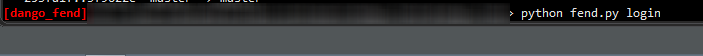
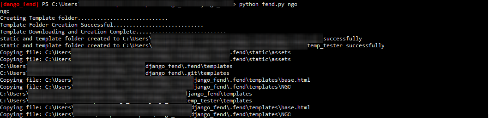

# FEnd
Simple script for adding Django ready template to pojects

Dango_FEnd is a simple script for generating front end codes for Django project.

Easy to use and Works with no external dependecies.

To use, simply 
1.clone this repository to your parent django project folder
2.issue python fend.py <desired template name> 
E.g:
python fend.py login

This would create your front-end.

Do check the quick start for sample codes and or help on how to implement the templates if you are new to python or Django

to get a list of all the available template options, simply type:
python fend.py -h

